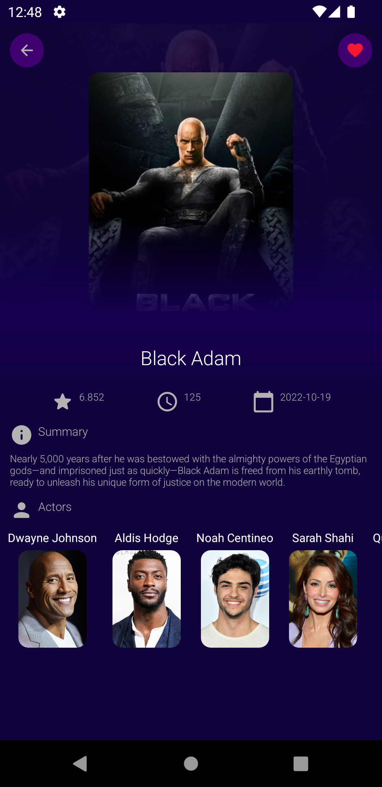

# Themoviedb-API-MVP

Overview :

The purpose of this application is to provide a list of Movies and show the details of each Movie

The app was written in Kotlin.

The API’s Docs: https://developers.themoviedb.org/3/getting-started
 
 
Technologies and Libraries Used :

- MVP
- Navigation Component
- View Binding
- Retrofit
- Dagger Hilt
- RxJava
- Room Database
- Coil

Screen-Shot :
 

